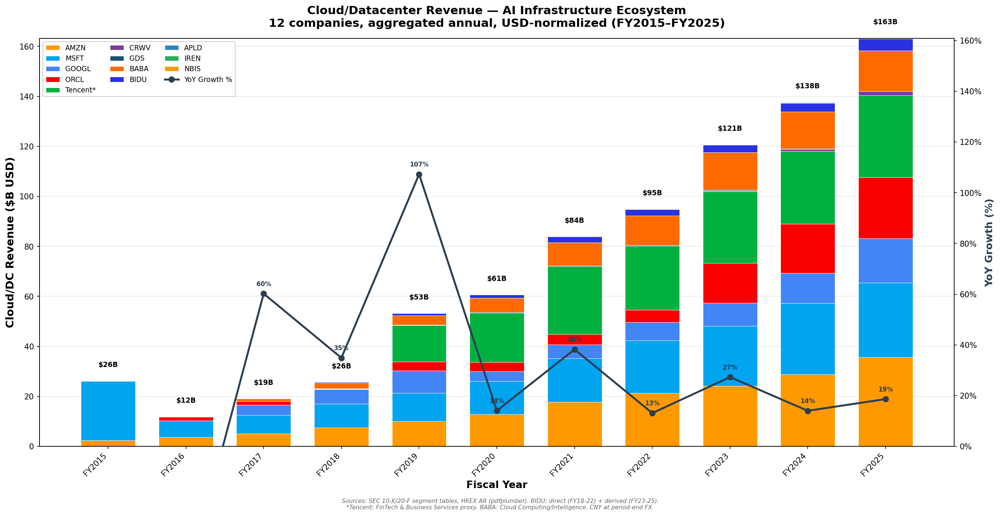
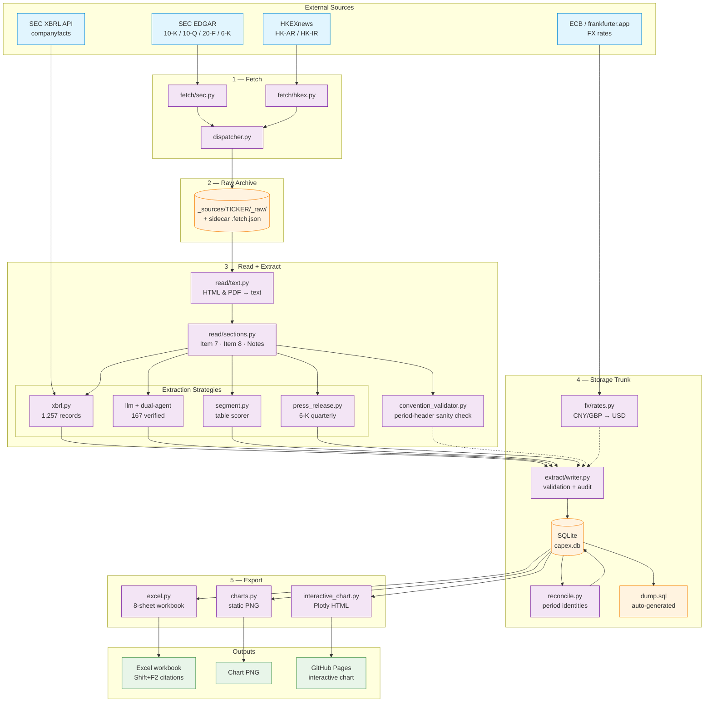

# neocloud-capex-tracker

Automated tracker for AI-related capital expenditure and cloud revenue
disclosures across major hyperscalers and neocloud providers.



**[Interactive Chart](https://KKKKKKAI.github.io/neocloud-capex-tracker/)** | **[Download Excel](workbook/capex_tracker_v18.xlsx)**

---

## What this is

A data pipeline that pulls quarterly and annual filings from SEC EDGAR
and HKEXnews, extracts financial metrics with full provenance, validates
every data point, and outputs an auditable Excel workbook where every
cell has a Shift+F2 citation linking to the exact filing, section, and
line item the number came from.

**13 companies** tracked. **1,455 data points** extracted.
**267 quarterly revenue** series across 12 companies.

<!-- ARCHITECTURE_START -->
## Architecture


<!-- ARCHITECTURE_END -->

## Data verification methods

Every extraction goes through a verification pipeline appropriate to
its source:

| Method | Records | How it works |
|---|---|---|
| **XBRL structured data** | 1,257 | Machine-readable SEC data. Values pulled from `data.sec.gov/api/xbrl/companyfacts/`. No LLM needed, no hallucination risk. Cross-checked against filing text. |
| **LLM + dual-agent verification** | 167 | Agent A reads the full filing and extracts value + context excerpts. Agent B receives ONLY the excerpts (not A's answer) and independently deduces the value. If A and B match: verified. If they disagree: refused, queued for human review. |
| **6-K press release extraction** | 31 | Quarterly revenue from 20-F filers' earnings press releases (6-K filings). Extracted via LLM, verified against filing text with provenance stored. |

**92 extractions** have passed dual-agent verification with evidence
stored in the `extraction_evidence` table. All citations in the Excel
workbook link to the exact SEC EDGAR or HKEXnews filing URL.

### Dual-agent verification flow

```
Agent A (Extractor)                    Agent B (Blind Verifier)
  Input:  Full filing + metric           Input:  ONLY A's excerpts
  Output: value + context excerpts       Output: independently deduced value
                                         (never sees A's answer)
              |                |
              +-- compare A,B -+
              |                |
        Match (exact/approx)    Mismatch
              |                     |
     Write to DB + store       Refuse to write
     evidence as citation      Queue for human review
```

## Companies tracked

| Category | Companies | Filing source | Quarterly |
|---|---|---|---|
| US Hyperscalers | MSFT, AMZN, GOOGL, META, ORCL | SEC EDGAR 10-K/10-Q | Yes (XBRL) |
| Chinese Hyperscalers | BABA, BIDU, GDS | SEC EDGAR 20-F/6-K | Yes (LLM from 6-K press releases) |
| HK-listed | Tencent (0700) | HKEXnews HK-AR | Annual only |
| Neoclouds | CRWV, APLD, IREN, NBIS | SEC EDGAR 10-K/10-Q/20-F | Varies |

## Metrics extracted

| Metric | Source | Coverage |
|---|---|---|
| Total revenue | XBRL + 6-K press releases | Annual + quarterly, 2015-2025 |
| Capital expenditures | XBRL | Annual + quarterly, 2015-2025 |
| Cloud/datacenter segment revenue | LLM extraction from filings | Annual, 2015-2025 |
| Operating cash flow | XBRL | Annual + quarterly, 2015-2025 |
| Depreciation & amortization | XBRL | Annual + quarterly, 2015-2025 |
| Property, plant & equipment (net) | XBRL | Annual + quarterly, 2015-2025 |

## Repository structure

```
src/capex/
  fetch/                  SEC EDGAR + HKEXnews filing downloaders
  read/                   HTML/PDF text extraction + section parsing
  extract/
    router.py             Unified extraction entry point
    coverage.py           coverage.yaml programmatic reader
    decumulate.py         Canonical quarterly de-cumulation
    extractors/           XBRL, segment regex, 6-K parser, LLM backends
    writer.py             DB writer with FX normalization + audit log
  verification/
    dual_agent.py         Dual-agent verification (hallucination prevention)
    evidence.py           Extraction evidence storage + retrieval
    comparator.py         Value comparison with tolerance
    prompts/              Agent A + Agent B prompt templates
  validation/
    checks.py             Range plausibility, YoY outlier checks
  xbrl/                   SEC XBRL companyfacts API time series
  fx/                     FX rate normalization (ECB via frankfurter.app)
  exporters/
    excel.py              Excel workbook generator (all values in USD)
    citations.py          Cell-level source citations for Shift+F2
    interactive_chart.py  Plotly HTML chart for GitHub Pages
    charts.py             Static PNG chart generator
  db/                     SQLite schema + migrations
  cli/                    Command-line interface

data/
  db/capex.db             SQLite database (system of record)
  db/dump.sql             Auto-generated SQL dump (for PR review)
  seeds/
    coverage.yaml         Per-company extraction treatments
    metric_definitions.yaml  Canonical metric registry
    chart_config.yaml     Chart visual standards

workbook/                 Generated Excel output (download above)
docs/                     GitHub Pages (interactive chart)
charts/                   Generated PNG charts
```

## CLI commands

```bash
capex db sync-all                    # initialize DB from YAML configs
capex fetch MSFT 10-K                # download filing from SEC EDGAR
capex extract MSFT --metric revenue  # extract via unified router
capex extract --batch                # batch extract all companies
capex review                         # show items pending human verification
capex export                         # generate Excel workbook
capex chart --interactive            # regenerate charts + GitHub Pages
```

## Development status

> Status key: ✅ Done — live and runnable | 🚧 In progress | 📋 Planned

| Phase | Feature | Status | Notes |
|-------|---------|--------|-------|
| 1 | DB foundation (schema, migrations, YAML sync) | ✅ | SQLite trunk, `dump.sql` auto-generated for PR review |
| 2a | SEC EDGAR fetcher (10-K, 10-Q, 20-F, 6-K) | ✅ | 12 companies, canonical filenames at download time |
| 2b | HKEXnews fetcher (HK-AR, HK-IR) | ✅ | Tencent annual + interim reports (PDF) |
| 3a | XBRL structured extraction | ✅ | 1,257 records from SEC companyfacts API |
| 3b | LLM dual-agent extraction + verification | ✅ | 167 verified, Agent A + Agent B independent agreement |
| 3c | 6-K press release extraction | ✅ | 31 records, BABA/BIDU/GDS quarterly revenue |
| 3d | Segment revenue table extraction | ✅ | Regex-based table scorer for cloud segment |
| 3e | FX normalization (CNY/GBP → USD) | ✅ | ECB rates via frankfurter.app |
| 4a | Excel workbook export | ✅ | 8 sheets, cell-level Shift+F2 citations, all values USD |
| 4b | Static PNG charts | ✅ | Annual cloud revenue with YoY overlay |
| 4c | Interactive Plotly chart + GitHub Pages | ✅ | Annual/quarterly toggle, deployed to Pages |
| 4d | Quarterly de-cumulation (10-Q YTD → standalone) | ✅ | Q4 derived from Annual - sum(Q1:Q3) |
| 4e | Calendar-quarter chart labels | ✅ | Non-Dec-FYE companies align on calendar Jan-Mar/Apr-Jun/Jul-Sep/Oct-Dec |
| 4f | Quarterly reporting convention config | ✅ | Per-company `quarterly_convention` in `coverage.yaml`; `convention_validator.py` checks filing headers; `period_type`/`basis_period_months` columns on `extractions` |
| 4g | Period reconciliation engine | ✅ | `extract/reconcile.py` derives Q1/Q2/Q3/Q4/H1/9M via identities (including Q1 = FY − Q2 − Q3 − Q4 for non-Dec-FYE filers); `capex reconcile` CLI; `scripts/audit_quarterly_coverage.py` matrix; `scripts/backfill_period_type.py` |
| 4h | Citation style: XBRL quote-based format | ✅ | "cross-checked against SEC XBRL structured data" sentence removed; structured locator line emitted for XBRL rows; Quote line surfaces from `extraction_evidence` without requiring dual-agent verification |
| 4i | Interactive chart aggregate YoY + QoQ legend toggles | ✅ | `docs/index.html` now has two aggregate growth lines (YoY default visible, QoQ quarterly-only and legend-only by default). Both recompute when companies are toggled via the legend. Math in `exporters/_growth.py` with unit test. |
| 4j | BABA quarterly cloud segment | ✅ | `scripts/extract_baba_cloud_6k.py` fetches each 6-K from SEC source_url, regex-matches "Cloud Intelligence Group revenue RMB…M". 30/30 filings extracted (after fixing a wrong 2025-06-30 source_url that pointed at an AGM circular). Reconcile fills BABA fiscal Q4 (calendar Q1) from 20-F annual. |
| 4k | BIDU quarterly cloud via Total − Online − iQIYI formula | ✅ | `scripts/extract_bidu_cloud_v2.py` walks EDGAR for every BIDU 6-K earnings press release (including Q4 filings that were missing from the DB before), fetches Exhibit 99.1, and extracts total revenue + online marketing + iQIYI per quarter. Cloud ≈ Total − Online − iQIYI (slight overstatement; still includes Apollo + smart-device hardware). 18 continuous quarters 2021Q1 → 2025Q3, including all Q4s 2022/2023/2024. `extracting_model='bidu-cloud-total-minus-online-minus-iqiyi@0.3.0'`. |
| 4l | DB schema: allow `period_token='Q4'` on source_documents | ✅ | Migration `0008_source_documents_q4.sql`. Previously the CHECK constraint forbade Q4 on the assumption SEC filers never produce a Q4 standalone doc (Q4 always rolls into 10-K). BIDU's Feb 6-K for prior-year-Q4 breaks that assumption. |
| 4m | Four interactive chart pages (cloud / revenue / capex / OCF) | ✅ | `interactive_chart.py` parameterised by `metric_key`; `generate_all_interactive()` emits `docs/index.html` (cloud), `docs/revenue.html`, `docs/capex.html`, `docs/operating_cash_flow.html` with a shared nav bar. Each page has the same stacked-bar + legend-toggle YoY/QoQ overlays. |
| 4n | XBRL duration-preference dedup + concept map extension | ✅ | `xbrl/timeseries.py` groups entries per `(end, form)` and picks the one whose duration is closest to the form-type-preferred length (90d for 10-Q, 365d for 10-K/20-F), eliminating TTM contamination that had stored AMZN Q1 2025 capex as $93B instead of $25B. Also added `PaymentsToAcquireProductiveAssets` (AMZN post-2017 concept) and `NetCashProvidedByUsedInOperatingActivities` (AMZN/others OCF concept) to `CONCEPT_MAP`. `scripts/refetch_xbrl_flow_metrics.py` backfilled 175 affected rows. |
| 4o | BABA annual capex FY21-FY24 backfilled | ✅ | BABA does not tag capex in XBRL. `scripts/backfill_baba_capex_20f.py` reads the Consolidated Statements of Cash Flows in each 20-F and inserts the canonical CNY value (FY21 = ¥36.2B → $5.5B, FY22 = $6.6B, FY23 = $4.4B, FY24 = $3.8B), FX-converted to USD at period-end. |
| 4p | XBRL extractions now carry filing-text quotes | ✅ | `scripts/backfill_xbrl_quotes.py` opens each locally-archived 10-K/10-Q, locates the numeric value in the filing text, grabs the surrounding sentence/table row, and writes it to `extraction_evidence` as a `primary_value` excerpt. The Excel cell comments now show a `Quote: "..."` line for 967 XBRL-sourced values. |
| 5a | Citation URL fixes | 🚧 | Direct filing URLs replacing SEC directory links |
| 5b | Annual data validation | 🚧 | Cross-checking LLM extractions vs XBRL anchors |
| 6 | Quarterly cloud segment extraction | 📋 | LLM-extract AWS/Azure/GCP quarterly segment revenue from 10-Qs so `cloud_segment_revenue` Q4 2019/2020 can be reconciled |
| 6b | XBRL filing-text quote backfill | 📋 | `xbrl_excerpt.py` to locate filing HTML snippets and populate `extraction_evidence` for XBRL-sourced rows |
| 7a | Fiscal calendar monitor | 📋 | Automated new-filing detection via Alpha Vantage |
| 7b | Headless LLM extraction (CLI `-p` mode) | 📋 | Unattended cron extraction without Claude Code session |
| 8a | Auto-publish pipeline | 📋 | CI-driven Excel + chart regeneration on new data |
| 8b | CSV / JSON / Parquet exporters | 📋 | Additional output formats from DB |
| — | Pluggable LLM adapters (Anthropic, Gemini, OpenAI) | 📋 | Replace interactive Claude Code extraction |

**Current data:** 13 companies, 1,455 data points, 267 quarterly revenue series, 92 dual-agent verified extractions.

## Getting started

```bash
pip install -e ".[export]"
capex db sync-all
capex extract --batch --metric revenue
capex export
```

## License

TBD. All rights reserved until a license is chosen.
