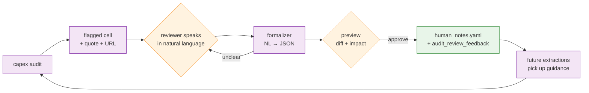
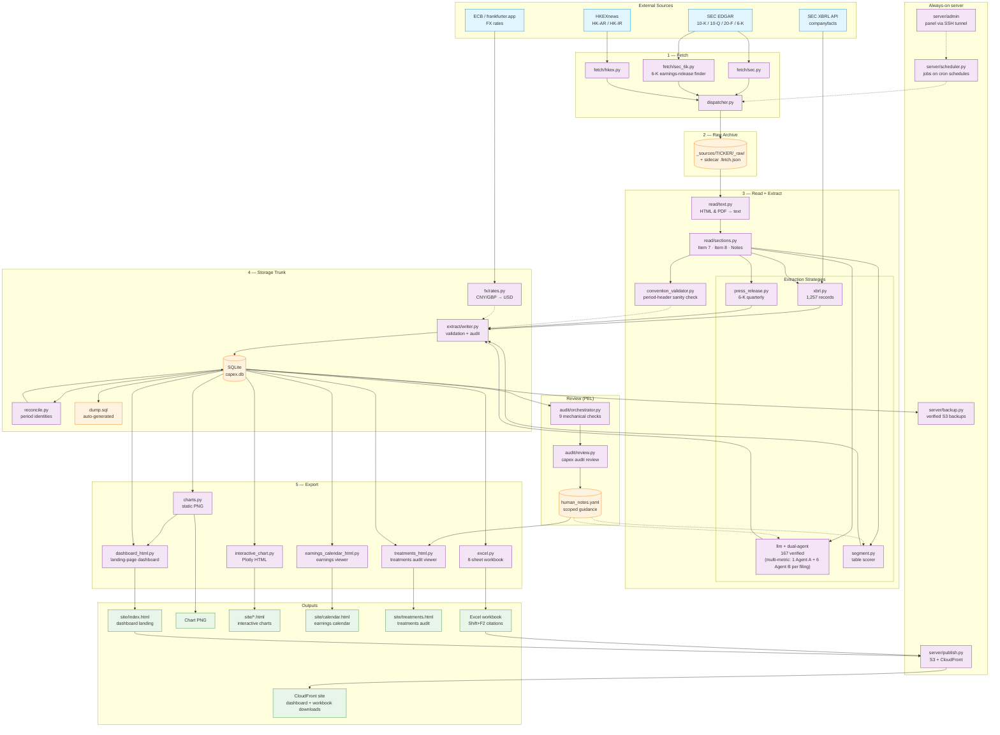

# neocloud-capex-tracker

Automated tracker for AI-related capital expenditure and cloud revenue
disclosures across major hyperscalers and neocloud providers.


**[Dashboard](https://d1pdb32k3hz8st.cloudfront.net/)** | **[Cloud / DC Revenue](https://d1pdb32k3hz8st.cloudfront.net/cloud.html)** | **[Earnings Calendar](https://d1pdb32k3hz8st.cloudfront.net/calendar.html)** | **[Treatments Audit](https://d1pdb32k3hz8st.cloudfront.net/treatments.html)** | **[Download latest Excel](https://d1pdb32k3hz8st.cloudfront.net/download/latest.xlsx)** | **[All workbooks](https://d1pdb32k3hz8st.cloudfront.net/workbooks.html)** | **[Review Workflow (PEL)](docs/PROTOCOL_ELICITATION_LOOP.md)** | **[Restatement Policy](docs/RESTATEMENT_POLICY.md)**

---

## What this is

A data pipeline that pulls quarterly and annual filings from SEC EDGAR
and HKEXnews, extracts financial metrics with full provenance, validates
every data point, and outputs an auditable Excel workbook where every
cell has a Shift+F2 citation linking to the exact filing, section, and
line item the number came from.

**13 companies** tracked by an always-on server that picks up each new
filing within the hour and republishes the site. Live counts and the
newest filing are on the [dashboard](https://d1pdb32k3hz8st.cloudfront.net/).

---

## Human-in-the-loop review — the Protocol Elicitation Loop

When an automated data-quality check flags something odd, the reviewer
rarely wants to hand-edit YAML. They want to *say*, in their own
words, what the agent should watch for next time — and have that
knowledge stick. The **Protocol Elicitation Loop (PEL)** is the
workflow that makes that happen: detect → contextualize → elicit →
formalize → preview → propagate → measure. Each note is scoped
(ticker × metric × period), provenance-tracked, revocable, and
injected into future extraction prompts automatically.


```mermaid
flowchart LR
    A[capex audit] --> B[flagged cell<br/>+ quote + URL]
    B --> C{reviewer speaks<br/>in natural language}
    C --> D[formalizer<br/>NL → JSON]
    D -- unclear --> C
    D --> E{preview<br/>diff + impact}
    E -- approve --> F[human_notes.yaml<br/>+ audit_review_feedback]
    F --> G[future extractions<br/>pick up guidance]
    G --> A

    classDef agent fill:#f3e5f5,stroke:#7b1fa2
    classDef human fill:#fff3e0,stroke:#f57c00
    classDef artifact fill:#e8f5e9,stroke:#388e3c
    class A,B,D,G agent
    class C,E human
    class F artifact
```

Run `capex audit review` after any audit run to walk the flagged
clusters. Full workflow spec, schema reference, and reuse guide live
in **[docs/PROTOCOL_ELICITATION_LOOP.md](docs/PROTOCOL_ELICITATION_LOOP.md)**.
The engine at `src/capex/pel/` is domain-agnostic and designed to be
re-used for any "automated check + human domain expert" feedback loop
beyond capex.

<!-- ARCHITECTURE_START -->
## Architecture


```mermaid
flowchart TD
    subgraph Sources["External Sources"]
        SEC["SEC EDGAR\n10-K / 10-Q / 20-F / 6-K"]
        HKEX["HKEXnews\nHK-AR / HK-IR"]
        XBRL["SEC XBRL API\ncompanyfacts"]
        ECB["ECB / frankfurter.app\nFX rates"]
    end

    subgraph L1["1 — Fetch"]
        SECF["fetch/sec.py"]
        SEC6K["fetch/sec_6k.py\n6-K earnings-release finder"]
        HKEXF["fetch/hkex.py"]
        DISP["dispatcher.py"]
    end

    subgraph L2["2 — Raw Archive"]
        RAW[("_sources/TICKER/_raw/\n+ sidecar .fetch.json")]
    end

    subgraph L4["3 — Read + Extract"]
        TEXT["read/text.py\nHTML & PDF → text"]
        SECT["read/sections.py\nItem 7 · Item 8 · Notes"]
        CVAL["convention_validator.py\nperiod-header sanity check"]

        subgraph Extractors["Extraction Strategies"]
            EX_XBRL["xbrl.py\n1,257 records"]
            EX_LLM["llm + dual-agent\n167 verified\n(multi-metric: 1 Agent A + 6 Agent B per filing)"]
            EX_SEG["segment.py\ntable scorer"]
            EX_6K["press_release.py\n6-K quarterly"]
        end
    end

    subgraph L3["4 — Storage Trunk"]
        FXR["fx/rates.py\nCNY/GBP → USD"]
        WRITER["extract/writer.py\nvalidation + audit"]
        RECONCILE["reconcile.py\nperiod identities"]
        DB[("SQLite\ncapex.db")]
        DUMP["dump.sql\nauto-generated"]
    end

    subgraph L5["Review (PEL)"]
        AUDIT["audit/orchestrator.py\n9 mechanical checks"]
        REVIEW["audit/review.py\ncapex audit review"]
        HNYAML[("human_notes.yaml\nscoped guidance")]
    end

    subgraph L6["5 — Export"]
        EXCEL["excel.py\n8-sheet workbook"]
        CHART["charts.py\nstatic PNG"]
        ICHART["interactive_chart.py\nPlotly HTML"]
        CALHTML["earnings_calendar_html.py\nearnings viewer"]
        TREATHTML["treatments_html.py\ntreatments audit viewer"]
        DASHHTML["dashboard_html.py\nlanding-page dashboard"]
    end

    subgraph Out["Outputs"]
        XLSX["Excel workbook\nShift+F2 citations"]
        PNG["Chart PNG"]
        GHPAGES["site/*.html\ninteractive charts"]
        CALPAGE["site/calendar.html\nearnings calendar"]
        TREATPAGE["site/treatments.html\ntreatments audit"]
        DASHPAGE["site/index.html\ndashboard landing"]
        CFSITE["CloudFront site\ndashboard + workbook downloads"]
    end

    subgraph Ops["Always-on server"]
        SCHED["server/scheduler.py\njobs on cron schedules"]
        PUBLISH["server/publish.py\nS3 + CloudFront"]
        BACKUP["server/backup.py\nverified S3 backups"]
        ADMIN["server/admin\npanel via SSH tunnel"]
    end

    ADMIN -.-> SCHED
    SCHED -.-> DISP
    XLSX --> PUBLISH
    DASHPAGE --> PUBLISH
    PUBLISH --> CFSITE
    DB --> BACKUP

    SEC --> SECF --> DISP
    SEC --> SEC6K --> DISP
    HKEX --> HKEXF --> DISP
    DISP --> RAW
    RAW --> TEXT --> SECT
    XBRL --> EX_XBRL
    SECT --> EX_XBRL
    SECT --> EX_LLM
    SECT --> EX_SEG
    SECT --> EX_6K
    ECB --> FXR
    EX_XBRL --> WRITER
    EX_LLM --> WRITER
    EX_SEG --> WRITER
    EX_6K --> WRITER
    SECT --> CVAL
    CVAL -.-> WRITER
    FXR -.-> WRITER
    WRITER --> DB
    DB --> RECONCILE --> DB
    DB --> DUMP
    DB --> EXCEL --> XLSX
    DB --> CHART --> PNG
    DB --> ICHART --> GHPAGES
    DB --> CALHTML --> CALPAGE
    DB --> AUDIT --> REVIEW --> HNYAML
    HNYAML -.-> EX_LLM
    HNYAML -.-> EX_SEG
    HNYAML --> TREATHTML
    DB --> TREATHTML --> TREATPAGE
    CHART --> DASHHTML
    DB --> DASHHTML --> DASHPAGE

    classDef source fill:#e1f5fe,stroke:#0288d1
    classDef store fill:#fff3e0,stroke:#f57c00
    classDef process fill:#f3e5f5,stroke:#7b1fa2
    classDef output fill:#e8f5e9,stroke:#388e3c

    class SEC,HKEX,XBRL,ECB source
    class RAW,DB,DUMP,HNYAML store
    class SECF,SEC6K,HKEXF,DISP,TEXT,SECT,CVAL,EX_XBRL,EX_LLM,EX_SEG,EX_6K,FXR,WRITER,RECONCILE,EXCEL,CHART,ICHART,CALHTML,TREATHTML,DASHHTML,AUDIT,REVIEW,SCHED,PUBLISH,BACKUP,ADMIN process
    class XLSX,PNG,GHPAGES,CALPAGE,TREATPAGE,DASHPAGE,CFSITE output
```
<!-- ARCHITECTURE_END -->

## Data verification methods

Every extraction goes through a verification pipeline appropriate to
its source:

| Method | Records | How it works |
|---|---|---|
| **XBRL structured data** | 1,257 | Machine-readable SEC data. Values pulled from `data.sec.gov/api/xbrl/companyfacts/`. No LLM needed, no hallucination risk. Cross-checked against filing text. |
| **LLM + dual-agent verification** | 167 | Agent A reads the full filing and extracts value + context excerpts. Agent B receives ONLY the excerpts (not A's answer) and independently deduces the value. If A and B match: verified. If they disagree: refused, queued for human review. |
| **6-K press release extraction** | 31 | Quarterly revenue from 20-F filers' earnings press releases (6-K filings). Extracted via LLM, verified against filing text with provenance stored. |

**92 extractions** have passed dual-agent verification with evidence
stored in the `extraction_evidence` table. All citations in the Excel
workbook link to the exact SEC EDGAR or HKEXnews filing URL.

### Dual-agent verification flow

```
Agent A (Extractor)                    Agent B (Blind Verifier)
  Input:  Full filing + metric           Input:  ONLY A's excerpts
  Output: value + context excerpts       Output: independently deduced value
                                         (never sees A's answer)
              |                |
              +-- compare A,B -+
              |                |
        Match (exact/approx)    Mismatch
              |                     |
     Write to DB + store       Refuse to write
     evidence as citation      Queue for human review
```

## Companies tracked

| Category | Companies | Filing source | Quarterly |
|---|---|---|---|
| US Hyperscalers | MSFT, AMZN, GOOGL, META, ORCL | SEC EDGAR 10-K/10-Q | Yes (XBRL) |
| Chinese Hyperscalers | BABA, BIDU, GDS | SEC EDGAR 20-F/6-K | Yes (LLM from 6-K press releases) |
| HK-listed | Tencent (0700) | HKEXnews HK-AR | Annual only |
| Neoclouds | CRWV, APLD, IREN, NBIS | SEC EDGAR 10-K/10-Q/20-F | Varies |

## Metrics extracted

| Metric | Source | Coverage |
|---|---|---|
| Total revenue | XBRL + 6-K press releases | Annual + quarterly, 2015-2025 |
| Capital expenditures | XBRL | Annual + quarterly, 2015-2025 |
| Cloud/datacenter segment revenue | LLM extraction from filings | Annual, 2015-2025 |
| Operating cash flow | XBRL | Annual + quarterly, 2015-2025 |
| Depreciation & amortization | XBRL | Annual + quarterly, 2015-2025 |
| Property, plant & equipment (net) | XBRL | Annual + quarterly, 2015-2025 |

## Repository structure

```
src/capex/
  fetch/                  SEC EDGAR + HKEXnews filing downloaders
  read/                   HTML/PDF text extraction + section parsing
  extract/
    router.py             Unified extraction entry point
    coverage.py           coverage.yaml programmatic reader
    decumulate.py         Canonical quarterly de-cumulation
    extractors/           XBRL, segment regex, 6-K parser, LLM backends
    writer.py             DB writer with FX normalization + audit log
  verification/
    dual_agent.py         Dual-agent verification (hallucination prevention)
    evidence.py           Extraction evidence storage + retrieval
    comparator.py         Value comparison with tolerance
    prompts/              Agent A + Agent B prompt templates
  validation/
    checks.py             Range plausibility, YoY outlier checks
  xbrl/                   SEC XBRL companyfacts API time series
  fx/                     FX rate normalization (ECB via frankfurter.app)
  exporters/
    excel.py              Excel workbook generator (all values in USD)
    citations.py          Cell-level source citations for Shift+F2
    interactive_chart.py  Plotly HTML chart pages (site/)
    charts.py             Static PNG chart generator
    dashboard_html.py     Dashboard landing page (site/index.html)
  db/                     SQLite schema + migrations
  cli/                    Command-line interface

data/
  db/capex.db             SQLite database (system of record)
  db/dump.sql             Auto-generated SQL dump (for PR review)
  seeds/
    coverage.yaml         Per-company extraction treatments
    metric_definitions.yaml  Canonical metric registry
    chart_config.yaml     Chart visual standards

deploy/                   AWS stack, server bootstrap, deploys, systemd units
docs/                     Design docs and runbooks (SERVER_OPERATIONS.md)
workbook/, charts/, site/ Generated outputs (published by the server)
```

## CLI commands

```bash
capex db sync-all                    # initialize DB from YAML configs
capex fetch MSFT 10-K                # download filing from SEC EDGAR
capex extract MSFT --metric revenue  # extract via unified router
capex extract --batch                # batch extract all companies
capex review                         # show items pending human verification
capex export                         # generate Excel workbook
capex chart --interactive            # regenerate charts + the site/ pages
capex server jobs | runs | health    # on the server (docs/SERVER_OPERATIONS.md)
```

## Development status

> Status key: ✅ Done — live and runnable | 🚧 In progress | 📋 Planned

| Phase | Feature | Status | Notes |
|-------|---------|--------|-------|
| 5a | Citation URL fixes | 🚧 | Direct filing URLs replacing SEC directory links |
| 5b | Annual data validation | 🚧 | Cross-checking LLM extractions vs XBRL anchors |
| 6 | Quarterly cloud segment extraction | 📋 | LLM-extract AWS/Azure/GCP quarterly segment revenue from 10-Qs so `cloud_segment_revenue` Q4 2019/2020 can be reconciled |
| 6b | XBRL filing-text quote backfill | 📋 | `xbrl_excerpt.py` to locate filing HTML snippets and populate `extraction_evidence` for XBRL-sourced rows |
| 8b | CSV / JSON / Parquet exporters | 📋 | Additional output formats from DB |
| — | Pluggable LLM adapters (Anthropic, Gemini, OpenAI) | 📋 | Replace interactive Claude Code extraction |

<details>
<summary><b>✅ Completed milestones (38)</b></summary>

| Phase | Feature | Notes |
|-------|---------|-------|
| 1 | DB foundation (schema, migrations, YAML sync) | SQLite trunk, `dump.sql` auto-generated for PR review |
| 2a | SEC EDGAR fetcher (10-K, 10-Q, 20-F, 6-K) | 12 companies, canonical filenames at download time |
| 2b | HKEXnews fetcher (HK-AR, HK-IR) | Tencent annual + interim reports (PDF) |
| 3a | XBRL structured extraction | 1,257 records from SEC companyfacts API |
| 3b | LLM dual-agent extraction + verification | 167 verified, Agent A + Agent B independent agreement |
| 3c | 6-K press release extraction | 31 records, BABA/BIDU/GDS quarterly revenue |
| 3d | Segment revenue table extraction | Regex-based table scorer for cloud segment |
| 3e | FX normalization (CNY/GBP → USD) | ECB rates via frankfurter.app |
| 4a | Excel workbook export | 8 sheets, cell-level Shift+F2 citations, all values USD |
| 4b | Static PNG charts | Annual cloud revenue with YoY overlay |
| 4c | Interactive Plotly chart + GitHub Pages | Annual/quarterly toggle, deployed to Pages |
| 4d | Quarterly de-cumulation (10-Q YTD → standalone) | Q4 derived from Annual - sum(Q1:Q3) |
| 4e | Calendar-quarter chart labels | Non-Dec-FYE companies align on calendar Jan-Mar/Apr-Jun/Jul-Sep/Oct-Dec |
| 4f | Quarterly reporting convention config | Per-company `quarterly_convention` in `coverage.yaml`; `convention_validator.py` checks filing headers; `period_type`/`basis_period_months` columns on `extractions` |
| 4g | Period reconciliation engine | `extract/reconcile.py` derives Q1/Q2/Q3/Q4/H1/9M via identities (including Q1 = FY − Q2 − Q3 − Q4 for non-Dec-FYE filers); `capex reconcile` CLI; `scripts/audit_quarterly_coverage.py` matrix; `scripts/backfill_period_type.py` |
| 4h | Citation style: XBRL quote-based format | "cross-checked against SEC XBRL structured data" sentence removed; structured locator line emitted for XBRL rows; Quote line surfaces from `extraction_evidence` without requiring dual-agent verification |
| 4i | Interactive chart aggregate YoY + QoQ legend toggles | `docs/index.html` now has two aggregate growth lines (YoY default visible, QoQ quarterly-only and legend-only by default). Both recompute when companies are toggled via the legend. Math in `exporters/_growth.py` with unit test. |
| 4j | BABA quarterly cloud segment | `scripts/extract_baba_cloud_6k.py` fetches each 6-K from SEC source_url, regex-matches "Cloud Intelligence Group revenue RMB…M". 30/30 filings extracted (after fixing a wrong 2025-06-30 source_url that pointed at an AGM circular). Reconcile fills BABA fiscal Q4 (calendar Q1) from 20-F annual. |
| 4k | BIDU quarterly cloud via Total − Online − iQIYI formula | `scripts/extract_bidu_cloud_v2.py` walks EDGAR for every BIDU 6-K earnings press release (including Q4 filings that were missing from the DB before), fetches Exhibit 99.1, and extracts total revenue + online marketing + iQIYI per quarter. Cloud ≈ Total − Online − iQIYI (slight overstatement; still includes Apollo + smart-device hardware). 18 continuous quarters 2021Q1 → 2025Q3, including all Q4s 2022/2023/2024. `extracting_model='bidu-cloud-total-minus-online-minus-iqiyi@0.3.0'`. |
| 4l | DB schema: allow `period_token='Q4'` on source_documents | Migration `0008_source_documents_q4.sql`. Previously the CHECK constraint forbade Q4 on the assumption SEC filers never produce a Q4 standalone doc (Q4 always rolls into 10-K). BIDU's Feb 6-K for prior-year-Q4 breaks that assumption. |
| 4m | Four interactive chart pages (cloud / revenue / capex / OCF) | `interactive_chart.py` parameterised by `metric_key`; `generate_all_interactive()` emits `docs/index.html` (cloud), `docs/revenue.html`, `docs/capex.html`, `docs/operating_cash_flow.html` with a shared nav bar. Each page has the same stacked-bar + legend-toggle YoY/QoQ overlays. |
| 4n | XBRL duration-preference dedup + concept map extension | `xbrl/timeseries.py` groups entries per `(end, form)` and picks the one whose duration is closest to the form-type-preferred length (90d for 10-Q, 365d for 10-K/20-F), eliminating TTM contamination that had stored AMZN Q1 2025 capex as $93B instead of $25B. Also added `PaymentsToAcquireProductiveAssets` (AMZN post-2017 concept) and `NetCashProvidedByUsedInOperatingActivities` (AMZN/others OCF concept) to `CONCEPT_MAP`. `scripts/refetch_xbrl_flow_metrics.py` backfilled 175 affected rows. |
| 4o | BABA annual capex FY21-FY24 backfilled | BABA does not tag capex in XBRL. `scripts/backfill_baba_capex_20f.py` reads the Consolidated Statements of Cash Flows in each 20-F and inserts the canonical CNY value (FY21 = ¥36.2B → $5.5B, FY22 = $6.6B, FY23 = $4.4B, FY24 = $3.8B), FX-converted to USD at period-end. |
| 4p | XBRL extractions now carry filing-text quotes | `scripts/backfill_xbrl_quotes.py` opens each locally-archived 10-K/10-Q, locates the numeric value in the filing text, grabs the surrounding sentence/table row, and writes it to `extraction_evidence` as a `primary_value` excerpt. The Excel cell comments now show a `Quote: "..."` line for 967 XBRL-sourced values. |
| 4q | Data-quality audit framework (`capex audit`) | New `src/capex/audit/` package with 9 mechanical checks (gap, identity, range, continuity, cross_source, sign, currency, segment_def, period_type), bounds YAML, markdown report generator, fix orchestrator, and an LLM re-verifier scaffold. 28 unit tests. Produces `output/data_quality_report.md` summarizing 4,171-cell universe coverage with flagged / gap-fixable / gap-unfixable breakdown. Dry-run by default; `--apply` commits fixes; `--with-llm` asks an LLM to re-verify flagged items. |
| 4r | Earnings calendar viewer (HTML + rich CLI) | `docs/calendar.html` is a 5th nav pill alongside the 4 chart pages — upcoming 90 days + recent 30 days grouped by date, per-row status badges (upcoming / detected / fetched / extracted / failed), `in N days` countdown, and direct SEC EDGAR / HKEXnews links once filings have landed. `capex calendar show` now prints a box-drawing table with `--days`, `--ticker`, `--format json`, `--include-past/--no-past` flags. Data sourced from the existing `fiscal_calendar` table + joined `source_documents`. Shared `query_for_viewer` in `monitor/calendar.py` is the single source of truth consumed by both the HTML and CLI. 13 unit tests cover fiscal-year/period derivation (Dec / Jun / May FYE), table formatting, nav pill presence, and empty-DB safety. |
| 4s | Protocol Elicitation Loop (`capex audit review`) | Closes the feedback gap between the data-quality audit and the reviewer's domain knowledge. Walks flagged clusters, captures free-form NL guidance, calls a formalization sub-agent (via `CLIBackend` → `claude -p`) that returns a scoped JSON artifact, previews the diff, writes a new `human_notes.yaml` entry + an `audit_review_feedback` row (migration 0010), and reports the re-audit delta. Notes are injected into `Agent A`'s prompt (`prompts/agent_a.txt :: {human_notes_block}`) and into the segment extractor's keyword matching, so future extractions pick up the guidance automatically. `writer.py` gains a `force=True` overwrite path with an `extraction_overwritten` audit-log trail for re-extract. Engine is split into `src/capex/pel/` (domain-agnostic: `Anomaly`/`Artifact`/`Effect`/`Checker`) and `src/capex/audit/review.py` (capex adapter) — the engine is reusable for any automated-check-plus-human-expert workflow beyond capex. 34 new unit tests (19 for `human_notes`, 15 for the PEL engine). Full illustrated spec in [docs/PROTOCOL_ELICITATION_LOOP.md](docs/PROTOCOL_ELICITATION_LOOP.md). |
| 4t | Treatments audit viewer (`docs/treatments.html` + `capex treatments show`) | Single-surface audit view of every human-authored rule: per-company cards showing `coverage.yaml` treatments (segment_names, adjustment formulas, quarterly_convention, filing_cadence, extraction_approach, company notes) + `human_notes.yaml` entries (scope, guidance, keywords, cautions, state, provenance) + joined `audit_review_feedback` verbatim reviewer input. 6th nav pill alongside the chart pages + calendar. Self-contained HTML with inline vanilla-JS search + ticker/metric dropdowns (no framework, no server). `capex treatments show` CLI mirror with boxed table + --ticker / --metric / --format json. Shared `query_treatments` in `src/capex/audit/treatments_query.py` is consumed by both HTML and CLI. New `iter_dataset_rules()` helper in `coverage.py` enumerates all per-ticker rules in one pass. 11 unit tests covering data-layer filters + feedback-join + nav-pill presence + CLI table shape. |
| 4u | Restatement-aware extraction (LLM dual-agent) | Closes the "latest filing wins" gap. When a company restates a historical period in a later 10-K / 20-F / 10-Q, the restated value supersedes the original across chart, Excel, and audit — and the Excel cell comment cites the *restating* filing. **Capture path**: the LLM dual-agent extractor, on every filing read, produces **one extraction per period visible in the target table** (current + every prior-year comparative) via a multi-period Agent A prompt. Agent B runs once per period for blind verification. Primary-period rows tag `extracting_model='llm-dual-agent'`; comparatives tag `'llm-dual-agent-restated@0.1.0'` and point at a virtual `source_documents` row whose `fiscal_year` matches the comparative period but whose citation fields come from the restating filing. Selectors in `interactive_chart`, `charts.py`, `audit/orchestrator`, `reconcile` all order by `source_documents.filing_date DESC`. Reconcile cascades (Q4 = FY − 9M etc.) automatically re-derive from the restated inputs. `capex audit` has a Restatements reporter (observational only). `coverage.yaml` carries `restatement_policy` blocks per known-restater, surfaced in the treatments viewer. `scripts/sweep_llm_restatements.py --validate-only` supports dry-run inspection. XBRL is deliberately not in the restatement loop — the previous `restated-xbrl` and regex-based `restated-segment` paths were reverted in favor of the end-to-end LLM flow. Full spec: [docs/RESTATEMENT_POLICY.md](docs/RESTATEMENT_POLICY.md). |
| 4v | Dashboard landing page (`docs/index.html`) | Replaces the single-chart landing page with a 6-card responsive dashboard. Each card links to its sub-page: four chart cards embed PNG thumbnails generated by `charts.py` (now generalised as `generate_metric_chart(metric_key)`); Calendar and Treatments cards use inline CSS mock-ups. The cloud/DC chart moves from `index.html` to `cloud.html`; a new `Home` nav pill appears first on every sub-page. Thumbnails are mirrored from `charts/` into `docs/charts/` at build time so GitHub Pages can serve them without escaping the Pages root. `dashboard_html.py` + 6 unit tests. |
| 7a | Fiscal calendar monitor | **Alpha Vantage = date discovery only (no data extraction).** It populates `fiscal_calendar` with forward earnings *dates* (3-month horizon) so the watcher knows when to start polling SEC. All financial data extraction is our own LLM dual-agent framework — Alpha Vantage never sees a value. `capex monitor --catch-up [--since YYYY-MM-DD] [--dry-run]` runs the watcher pipeline (`monitor/pipeline.py`):<ul><li>For every watched company whose report date has passed, it polls SEC and matches the filing to the period.</li><li>Foreign filers (NBIS, GDS, BIDU, BABA) report quarters in 6-K press releases. `fetch/sec_6k.py` picks the earnings release out of their buyback returns and meeting notices, reads its period from the text, and remembers the 6-Ks it ruled out.</li><li>It then fetches that exact accession and extracts (XBRL first, then LLM; 6-K releases go straight to the LLM), tracking each filing in `filing_events`.</li><li>Partial extractions are retried with backoff, rows whose filing never arrives go stale, and an LLM auth or usage-limit error stops the run instead of marking filings done.</li></ul>**It runs on the always-on server** (row 7e): the watcher every 20 minutes and the calendar sync daily, with no laptop involved. `capex monitor` still works locally against a snapshot (`scripts/pull_server_snapshot.sh`). |
| 7b | Headless LLM extraction (CLI `-p` mode) | Unattended cron extraction via `claude -p`. `LLMHeadlessExtractor` (per-metric) drives the per-metric flow used by PEL re-extract, audit re-verify, and the restatement sweep. Dual-agent verification runs without an interactive session. |
| 7c | Multi-metric Agent A per filing | Watcher's `extract_filing()` makes ONE Agent A call per filing covering all 6 metrics (~106K input chars), then ONE Agent B call per metric (each batched across periods). Cost drops from ~600K → ~112K input chars per filing (~5× cheaper, ~5× faster). Per-metric fallback fires automatically for any metric the multi-metric pass can't satisfy — worst case = today's per-metric cost. `LLMHeadlessFilingExtractor` + `build_agent_a_multi_metric_prompt` + `parse_agent_a_multi_metric_response`. Per-metric `extract_metric()` API preserved for PEL/audit. |
| 7d | Email notifications on new filings | After every successful auto-update, sends one HTML+text email per (subscriber, filing) pair. Subject leads with the headline metric (e.g. `📊 GOOGL Q1 FY2026 10-Q — revenue $109.9B (+12.1% YoY, -3.5% QoQ)`); body has a clean table with each metric's current value + prior-quarter delta + prior-year delta. Subscribers live in the server DB's `subscribers` table (every change audited). Real emails never enter the public repo. Per-subscriber ticker / metric filters supported. Gmail SMTP via stdlib (`GMAIL_USERNAME` + `GMAIL_APP_PASSWORD`, loaded from SSM on the server). Links point at the public site. CLI: `capex notify {list,add,remove,enable,disable,test,import-yaml}`. Crash-safe — SMTP failures log but never break the run that just succeeded at extraction. |
| 7e | Always-on server: scheduler and jobs | `capex server scheduler` runs every job on a cron schedule in Europe/London (missed runs collapse into one). Each run is a process with a timeout, logged in `runs`. The jobs are watcher every 20 min, filings sweep, calendar sync, regenerate, publish, backups, health, LLM check and prune. `server/publish.py` mirrors the site and every workbook to S3 behind CloudFront: only changed files, `download/latest.xlsx`, and workbooks served under their real names. Nightly verified DB backups go to S3. Health checks and failures email the operator, de-duplicated. Live since 2026-09-29 on AWS (EC2 + S3 + CloudFront). Merges to `main` deploy themselves once CI passes, and roll back if unhealthy. Runbook: `docs/SERVER_OPERATIONS.md`. |
| 7f | Admin panel (SSH tunnel) | `capex server admin` on the server's 127.0.0.1:8081, opened with `scripts/admin_tunnel.sh`. It controls which companies are watched and with which forms, calendar dates, retry/ignore/ingest of filings, job schedules with Run now, subscribers and alert emails, and every runtime setting, including Claude budget and pause. It also shows runs with logs, health and an audit trail. No password: the SSH key is the gate. Host check, form tokens and same-origin POSTs block browser-based attacks. |
| 8a | Auto-publish pipeline | The server's `publish` job (row 7e): S3 + CloudFront instead of CI. |
| 9a | Always-on AWS server | Live since 2026-09-29. `deploy/aws/capex-stack.yaml` (EC2 + persistent data volume, S3 + CloudFront site, versioned backup bucket), `deploy/bootstrap.sh`, secrets from SSM Parameter Store, `deploy/capex-deploy.sh` (merges to `main` deploy themselves once CI passes, with automatic rollback), health checks and operator alerts. Runbook: `docs/SERVER_OPERATIONS.md`; history: `docs/SERVER_MIGRATION_CHECKLIST.md` |

</details>

**Current data:** 13 companies. The live data-point count and the newest filing are on the [dashboard](https://d1pdb32k3hz8st.cloudfront.net/), updated by the server as filings arrive.

## Getting started

The tracker runs itself on its server; the public site is the way to read it. To develop
locally (WSL), set up the locked environment and work on a copy of the server's data:

```bash
scripts/dev_setup.sh                       # uv + Python 3.12 venv from uv.lock
source ~/.venvs/capex/bin/activate
scripts/pull_server_snapshot.sh            # newest server backup -> ~/capex-snapshot
CAPEX_HOME=~/capex-snapshot capex export   # e.g. rebuild a workbook locally
pytest -q
```

Changes reach the server by merging to `main`: it deploys the commit once CI passes.

## License

TBD. All rights reserved until a license is chosen.
