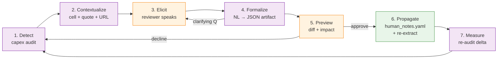

# Protocol Elicitation Loop (PEL)

A human-in-the-loop workflow for closing the feedback gap between an
automated data-quality check and the domain knowledge that lives only
in the reviewer's head.

The loop lets a reviewer say, in their own words, *why* a flagged
extraction is wrong — and an agent turns that into a scoped, durable
protocol that future extraction runs obey automatically. No YAML
editing by hand. No one-off patches. A single unit of human judgment,
formalized once, applied forever (or until revoked).

This document is the authoritative spec for the workflow. See
`src/capex/pel/` for the domain-agnostic engine and
`src/capex/audit/review.py` for the capex adapter.

---

## The seven-stage loop



Each stage owns a clear responsibility:

| # | Stage | Who | Output |
|---|-------|-----|--------|
| 1 | Detect | automated checks | list of flagged cells with stable IDs |
| 2 | Contextualize | engine | Anomaly with quote + source URL + failed checks + neighbors |
| 3 | Elicit | **reviewer** | free-form natural-language guidance |
| 4 | Formalize | sub-agent | structured JSON (scope, guidance, keywords, cautions) |
| 5 | Preview | **reviewer** | y/N on the proposed diff |
| 6 | Propagate | engine | appends to `human_notes.yaml`, logs `audit_review_feedback` row |
| 7 | Measure | engine | reports re-audit pass/fail delta after re-extraction |

---

## End-to-end example (BABA cloud FY23)

### Stage 1 — Detect

`capex audit` runs the 9-check suite over the universe and classifies
every cell. One cluster comes out flagged:

```
BABA — cloud_segment_revenue  (4 cells)
   FY2023 Q1:  $3.2B USD   continuity ↗ 28% vs FY2022 Q4
   FY2023 Q2:  $3.3B USD   continuity ↗ 31% vs FY2022 Q4
   FY2023 Q3:  $3.4B USD   continuity ↗ 29% vs FY2022 Q4
   FY2023 Q4:  $4.1B USD   continuity ↗ 41% vs FY2022 Q4
```

### Stage 2 — Contextualize

`capex audit review` loads the JSON sidecar (`output/data_quality_report.json`),
groups the flagged cells by `(ticker, metric_key)`, and pulls the
primary-value quote + source URL for each via `extraction_evidence`:

```
Filing excerpt (FY2023 Q2):
  "Cloud Intelligence Group revenue, excluding revenue from
   Alibaba-consolidated subsidiaries, totaled RMB 26,549 million …"
  — https://www.sec.gov/Archives/edgar/data/1577552/…/ex99-1.htm

Current treatment: named_segment
segment_names=['Cloud Intelligence Group']
```

### Stage 3 — Elicit

```
> What should future extractors watch out for here?
reviewer: starting fy23 the cloud segment excludes bytedance so
          pre/post aren't comparable. the phrase "excluding revenue
          from alibaba-consolidated subsidiaries" is the signal that
          the reporting changed.
```

### Stage 4 — Formalize

The NL input + the cell context go to a sub-agent (via `CLIBackend` →
`claude -p`). The sub-agent returns a JSON block conforming to the
schema in `src/capex/audit/prompts/formalize_note.md`:

```json
{
  "note": {
    "scope": {
      "ticker": "BABA",
      "metric_keys": ["cloud_segment_revenue"],
      "period_range": "FY2023+",
      "form_types": null
    },
    "guidance": "From FY23 Q1 onward, BABA's 'Cloud Intelligence Group' revenue excludes ByteDance-related revenue (ByteDance deconsolidated FY23 Q1). Pre- and post-FY23 figures are not directly comparable.",
    "keywords_to_match": [
      "Cloud Intelligence Group",
      "excluding revenue from Alibaba-consolidated subsidiaries"
    ],
    "cautions": [
      "One-time YoY drop in FY23 is reclassification, not organic"
    ]
  },
  "linked_cells": [
    "BABA:cloud_segment_revenue:2023Q1",
    "BABA:cloud_segment_revenue:2023Q2",
    "BABA:cloud_segment_revenue:2023Q3",
    "BABA:cloud_segment_revenue:2023Q4"
  ],
  "clarifying_questions": [],
  "confidence": "high"
}
```

If `confidence` is not `"high"` or `clarifying_questions` is
non-empty, the loop bounces back to Stage 3 for another round — the
session never commits a half-sure artifact.

### Stage 5 — Preview

```
Proposed human note:
  scope      BABA × cloud_segment_revenue × FY2023+
  guidance   From FY23 Q1 onward, BABA's 'Cloud Intelligence Group'
             revenue excludes ByteDance-related revenue…
  keywords   "Cloud Intelligence Group" ·
             "excluding revenue from Alibaba-consolidated subsidiaries"
  caution    One-time YoY drop in FY23 is reclassification, not organic
  affected   4 cells (BABA:cloud_segment_revenue:2023Q1,
             BABA:cloud_segment_revenue:2023Q2…)
  confidence high

Apply? [y/N]: y
```

### Stage 6 — Propagate

The engine appends to `data/seeds/human_notes.yaml`:

```yaml
schema_version: 1
notes:
  - id: HN-2026-04-20-001
    scope:
      ticker: BABA
      metric_keys: [cloud_segment_revenue]
      period_range: "FY2023+"
      form_types: null
    guidance: |
      From FY23 Q1 onward, BABA's "Cloud Intelligence Group" revenue
      excludes ByteDance-related revenue (ByteDance deconsolidated FY23 Q1).
      Pre- and post-FY23 figures are not directly comparable.
    keywords_to_match:
      - "Cloud Intelligence Group"
      - "excluding revenue from Alibaba-consolidated subsidiaries"
    cautions:
      - "One-time YoY drop in FY23 is reclassification, not organic"
    state: active
    added_at: 2026-04-20T10:15:00Z
    added_by: human_review
    source_audit_run_id: audit-20260420-101200
    source_cell_keys:
      - BABA:cloud_segment_revenue:2023Q1
      - BABA:cloud_segment_revenue:2023Q2
      - BABA:cloud_segment_revenue:2023Q3
      - BABA:cloud_segment_revenue:2023Q4
```

…and writes a row to the `audit_review_feedback` table carrying the
reviewer's verbatim input + the raw formalization JSON.

The engine then prints the shell commands the reviewer should run to
re-extract the affected cells with the new guidance:

```
Next step — re-extract affected cells with the new guidance:
  BABA:cloud_segment_revenue: capex extract BABA --metric cloud_segment_revenue --force
```

Re-extraction is **always** explicit. The PEL never triggers
pipeline work without a human command — this keeps side effects
reviewable and reversible.

### Stage 7 — Measure

After the reviewer runs the re-extract command, the next `capex audit`
will show the continuity check passing for the four cells, and the
flagged count shrinks by four. The `audit_review_feedback` ledger
carries the full provenance — who asked what, when, and which note
resulted.

---

## How the note reaches the extractor

`LLMHeadlessExtractor.extract()` resolves applicable notes for every
extraction call:

```python
hnotes = human_notes.resolve(
    ticker=ticker,
    metric_key=metric_key,
    fiscal_year=fy,
    form_type=row["form_type"],
)
human_notes_block = human_notes.format_for_prompt(hnotes)
prompt_a = build_agent_a_prompt(..., human_notes_block=human_notes_block)
```

The block is inserted in `prompts/agent_a.txt` between the metric
description and the filing sections. Agent A now sees:

```
## Company-specific guidance (authored by prior human reviewers)

BABA · cloud_segment_revenue · FY2023+  (note HN-2026-04-20-001)
- From FY23 Q1 onward, BABA's "Cloud Intelligence Group" revenue
  excludes ByteDance-related revenue…
  - Keywords to find: "Cloud Intelligence Group",
    "excluding revenue from Alibaba-consolidated subsidiaries"
  - Caution: One-time YoY drop in FY23 is reclassification, not organic
```

The segment extractor (regex-based, `SegmentExtractor`) also consumes
`keywords_to_match` — it merges them into `segment_names` before
scoring tables, so renamed/re-classified segment labels still score
highly.

---

## Schema reference

### `data/seeds/human_notes.yaml`

```yaml
schema_version: 1
notes:
  - id: HN-YYYY-MM-DD-NNN         # generated by next_note_id()
    scope:
      ticker: str | null          # null → applies to all tickers
      metric_keys: [str] | null   # null → applies to all metrics
      period_range: str | null    # "FY2023" | "FY2023+" | "FY2021-FY2023" | null
      form_types: [str] | null    # null → applies to all forms
    guidance: str                  # multiline NL, preserves reviewer's wording
    keywords_to_match: [str]       # filing phrases that boost segment recall
    cautions: [str]                # downstream-effect warnings
    state: "active" | "superseded" | "revoked"
    added_at: ISO datetime
    added_by: str                  # "human_review"
    source_audit_run_id: str
    source_cell_keys: [str]        # {ticker}:{metric}:{fy}{pt}
    rationale: str                 # optional
```

### `audit_review_feedback` (migration 0010)

| Column | Type | Role |
|---|---|---|
| id | INTEGER PK | |
| audit_run_id | TEXT | `audit-YYYYMMDD-HHMMSS` |
| cell_key | TEXT | `{ticker}:{metric}:{fy}{pt}` |
| human_input | TEXT | verbatim reviewer text |
| formalized_note_id | TEXT | FK (soft) to a `human_notes.yaml` `id` |
| formalization_json | TEXT | raw JSON from the sub-agent |
| reviewer | TEXT | attribution |
| reviewed_at | TEXT | ISO datetime |
| UNIQUE (audit_run_id, cell_key) | | |

### Formalizer JSON contract

```json
{
  "note": { "scope": {…}, "guidance": str, "keywords_to_match": [str], "cautions": [str] },
  "linked_cells": [str],                // ⊆ sibling_cells in context
  "clarifying_questions": [str],        // empty when confident
  "confidence": "low" | "medium" | "high"
}
```

Rules enforced by the session:
- `linked_cells` must be a subset of the sibling cells in the
  anomaly context. The session drops any id it did not provide.
- A note is committed only when `confidence == "high"` **and**
  `clarifying_questions` is empty.
- Clarifications loop up to 3 times before the engine gives up.

---

## Reusing the PEL engine beyond capex

The engine in `src/capex/pel/` is domain-agnostic. A new domain
adapter implements four tiny interfaces:

```python
from capex.pel import Anomaly, Artifact, ReviewSession, Formalizer

# 1. Build Anomaly objects from your flagged items.
anomalies = [Anomaly(id=..., title=..., context={...}), ...]

# 2. Provide a Formalizer — your prompt template + a ModelBackend.
formalizer = Formalizer(backend, prompt_template=open("my_prompt.md").read())

# 3. Tell the session how to write artifacts, re-run the pipeline,
#    and re-check the result.
def write_artifact(art, run_id): ...
def effect(affected_ids): ...; return "summary"
def checker(affected_ids): ...; return (passed, total)
def build_artifact(formalizer_result, anomaly): ...

# 4. Run.
session = ReviewSession(
    anomalies=anomalies,
    formalizer=formalizer,
    write_artifact=write_artifact,
    effect=effect, checker=checker,
    build_artifact=build_artifact,
    callbacks=callbacks,
)
session.run(run_id="run-X")
```

Candidate re-use cases we'd expect to wire this against:
- ML misclassification triage (anomaly = misclassified example,
  artifact = labelling rule, effect = re-run inference)
- Security false-positive taming (anomaly = alert, artifact =
  suppression filter, effect = re-evaluate rules)
- Data-pipeline upstream quirks (anomaly = failed row, artifact =
  vendor-specific note, effect = re-parse)

The engine does not know what domain it is running — so the same
engine, tested against a fake domain in `tests/unit/test_pel_engine.py`,
works for capex and (eventually) for anything else that has
automated anomaly detection plus human domain knowledge.

---

## Design principles

1. **Never ask the human to write YAML.** They speak NL, the agent
   formalizes. If the formalizer has to guess, it asks instead.
2. **Always preview the diff.** Reversibility is built in — the
   reviewer can decline the artifact even after formalization.
3. **Provenance is non-negotiable.** Every note carries its origin
   audit run, the cell that triggered the review, and the reviewer's
   verbatim input (stored in `audit_review_feedback`).
4. **Scope by construction.** Notes are always scoped by ticker,
   metric, period range, and form type. Nothing "applies forever to
   everything" unless the reviewer explicitly said so.
5. **Effects are explicit.** The engine never re-runs extraction
   silently. It prints the exact commands the reviewer should run.
6. **Revocable.** Notes can be set to `state: revoked` without
   deleting history — the prompt injection just skips them.
7. **Measurable.** Every committed note produces a before/after delta
   the reviewer sees immediately + a permanent trail in the DB.

---

## CLI reference

```
capex audit                          # run the audit (emits .md + .json)
capex audit review                   # walk all flagged clusters
capex audit review --cluster BABA:cloud_segment_revenue
capex audit review --limit 3        # review at most 3 clusters
capex audit review --report PATH     # use a non-default sidecar

capex extract BABA --metric cloud_segment_revenue --force
                                     # overwrite existing extractions
                                     # with audit_log trail
```

---

## Files

| Path | Role |
|---|---|
| `src/capex/pel/protocol.py` | Anomaly / Artifact / Effect / Checker / ReviewOutcome |
| `src/capex/pel/formalizer.py` | NL → JSON translator |
| `src/capex/pel/session.py` | Review state machine |
| `src/capex/audit/human_notes.py` | YAML loader + scope matcher + prompt rendering |
| `src/capex/audit/review.py` | Capex adapter: cluster builder, effect/checker, callbacks |
| `src/capex/audit/prompts/formalize_note.md` | Formalization prompt template |
| `data/seeds/human_notes.yaml` | The elicited guidance store |
| `src/capex/db/migrations/0010_audit_review_feedback.sql` | Review-interaction ledger |
| `src/capex/verification/prompts/agent_a.txt` | Injection point for `{human_notes_block}` |
| `src/capex/extract/extractors/llm_headless.py` | Resolves notes + passes to Agent A prompt |
| `src/capex/extract/extractors/segment_ext.py` | Merges `keywords_to_match` into segment scoring |
| `src/capex/extract/writer.py` | `force=True` overwrite path with audit trail |
